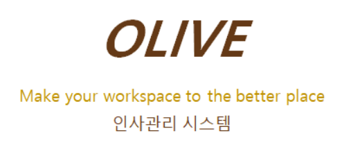
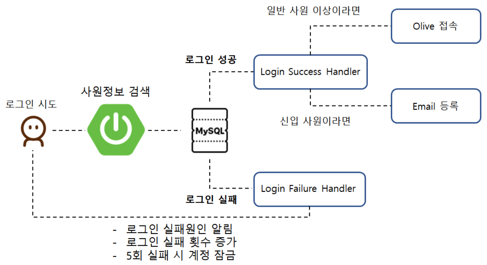
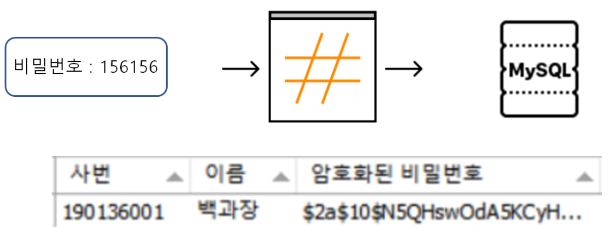
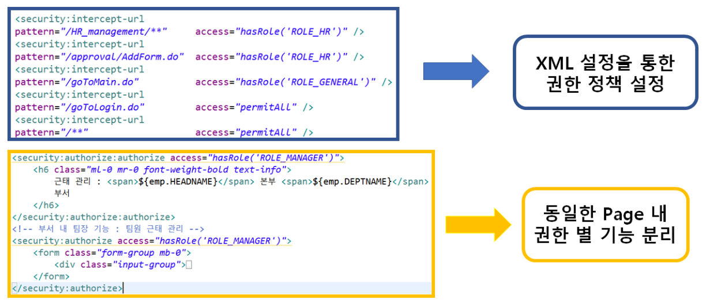
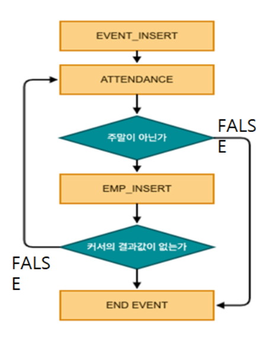
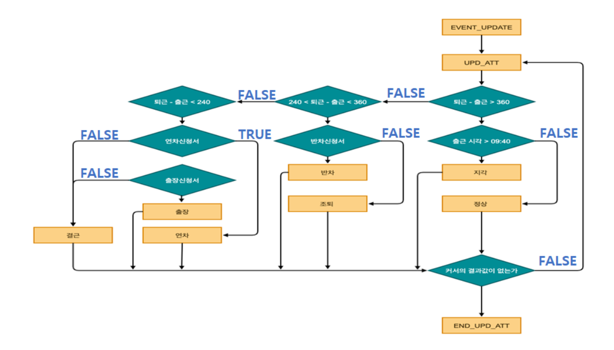
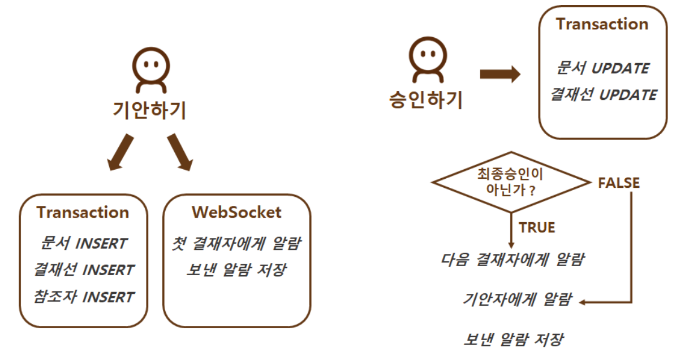
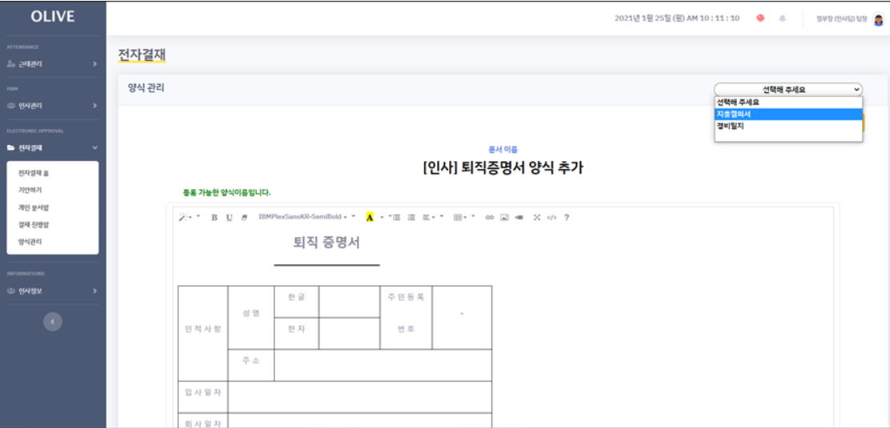
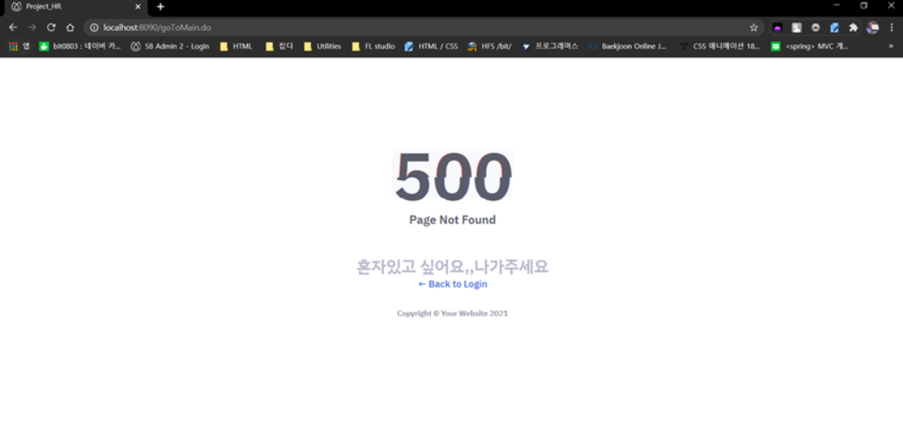

### 비트캠프 파이널 팀 프로젝트

인사관리 및 전자결재 시스템[인트라넷]

기간 : 2020-12-14 ~ 2021-01-24 (약 6주)

구성원 : 정민찬 / 박채연 / 박선우 / 심재형 / 백희승

### 개발 환경 및 API

| **FRONT**       | HTML5, CSS, Javascript, Jquery, Ajax                         |
| --------------- | ------------------------------------------------------------ |
| **BACK**        | **Java, Spring, Mybatis,**                                   |
| **DB & SERVER** | **Mysql, Apache-Tomcat**                                     |
| **API**         | **Chart.js, FullCalendar, SweetAlert, Summernote, Naver API, FontAwesome, Java Mail API** |
| **TOOLKIT**     | **STS, eXERD, Mysql-workbench, Dbearver,**                   |
| **COOPREATION** | **Github, Google-Drive, Slack, Notion**                      |

### Spring Security 로그인

### **Spring Security** **로그인** **-** **Bcrypt**

### **Spring Security –** **권한** **설정**

## PL-SQL

### - INSERT

### - UPDATE

## Web Socket

### **Dynamic Query**

### **문서** **양식** **추가**

### **GeoLocation** **&** **날씨** **API**

### 에러 페이지 처리

